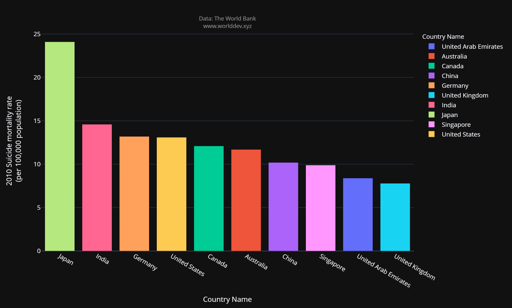

 # Individual project Part A Draft
 * Name : Akhil Kumar Kondamidi
 
 ## Determine what topics are interesting to you?
 * Economy & Growth
 * Health

## Determine what indicators are interesting to you?
* GDP per capita
* Life Expectancy at Birth
* Suicide Mortality rates

## Determine what countries are interesting to you?
* India
* USA
* Canada
* Germany 
* Australia
* Singapore
* China 
* Japan 
* United Kingdom 
* UAE

## Determine what time span you would like to cover?
* 2010 to 2018

## What is it that you are investigating/exploring/analysing (provide sufficient background information)?
In this report, I will examine the GDP per capita, Life Expectancy at Birth, and Suicide Mortality rates of different nations from 2010 to 2018, to see if the country's GDP has any impact on the population's Life Expectancy and Suicide Mortality rates. The countries I have chosen are  India, China, the United Kingdom, the United States, and Japan, as well as Singapore, Australia, Canada, the United Arab Emirates, and Germany
 
Gross domestic product(GDP) is the  total monetary or market worth of all finished goods and services produced inside a country's borders in a certain time period. The GDP per capita of a country is calculated by dividing its GDP by its population. Life expectancy  at birth is defined as how long they can expect to live on average if current death rates do not change. Suicide mortality rate is calculated by dividing the number of suicides each year by the total population.
 
## Why is it important to you and/or to others
Understanding a country's GDP is crucial since it reflect health of the economy. The country's mortality is determined by the life expectancy at birth and  suicide mortality rate . I chose these variables to examine if people with high GDP countries live longer than people in low GDP countries, and if a country's economic well-being  can contribute to people living longer.
 
## What questions do you have in mind and would like to answer?
The questions I have in my mind and want to analyze are 
- Which country has the most GDP among the selected countries, and which country has the lowest, and what is the Life Expectancy and Suicide Mortality of the countries?
- How have the countries' GDP, Life Expectancy, and Suicide Mortality Rates changed throughout time?
- Is there any relationship between a country's GDP and its population's Life Expectancy and Suicide Mortality rate over time?

## Where do you get the data to help answer your questions?
To help us access this situation three indicators are considered from https://www.worlddev.xyz/ website.

## What process/step you use to analyze the situation/issue?	
I analyzed the problem using Bar chart, scatter plot and line chart.

## Country wise GDP per capita for the year 2010

In the above bar chart, Country Name is on the X-axis, GDP per capita, PPP for 2010 is on the Y-axis, and each bar represents the GDP of a certain country.

From the bar chart,
* As seen, Singapore has the greatest GDP per capita, followed by the UAE and the United States. India has the lowest GDP per capita in the world.
* It's noteworthy to observe that Canada, Australia, and Germany have comparable GDP per capita.

## Country wise Suicide mortality rate for the year 2010

In the above Bar chart, the X-axis indicates the nation name, and the Y-axis shows the suicide mortality rate (per 100,000 people) for 2010. Each bar represents the Suicide Mortality rate of a certain country.

From the bar chart,
* As seen, Japan has the highest rate of Suicide Mortality, followed by India and Germany. The United Kingdom has the lowest rate of Suicide Mortality.

## Country wise life expectancy at birth for the year 2010

The X-axis in the above Bar chart is Country Name, and the Y-axis is Life Expectancy at Birth, total (years) for the year 2010, and each bar indicates the Life Expectancy for a certain country.

From the chart,
* The highest Life Expectancy at Birth may be found in Japan, Australia, and Singapore, while the lowest Life Expectancy can be found in India.

## Line charts to show how GDP per capita, Life Expectancy at Birth, and Suicide Mortality Rates have changed for countries and regions from 2010 to 2018.

## Line chart for GDP per capita

The time period in years from 2010 to 2018 is taken along the X-axis in the above Line chart, while GDP per capita, PPP is taken along the Y-axis, and each line represents a specific country's GDP over the time period.

From the chart,
* Singapore has the greatest GDP per capita, followed by the UAE and the United States. Over the years, India has had the lowest GDP per capita.
* Singapore's GDP per capita increased significantly between 2014 and 2018.
* The UAE's GDP has dropped significantly since 2014, though it has increased marginally since 2016.

## Line chart for Suicide mortality Rate

The time period in years from 2010 to 2018 is taken along the X-axis in the above Line chart, and the Suicide mortality rate (per 100,000 population) is taken along the Y-axis, and each line represents a specific country's Suicide mortality rate for the time period.

From the chart,
* As seen, Japan had the highest suicide fatality rate in 2010, which declined dramatically from 2010 to 2018.
* The United States, which ranked fourth in terms of suicide death rate in 2010, rose to second by the conclusion of the time period in 2018.
* During the same time period, India saw a modest decline in the suicide mortality rate.

## Line chart for Life expectancy at birth

In the above Line chart, the time period in years from 2010 to 2018 is taken along the X-axis, and Life Expectancy at Birth, total (years) is taken along the Y-axis, and each line shows a specific country's Life Expectancy at Birth across the time period.

From the chart,
* As seen, Japan, Singapore, and Australia have the highest Life Expectancy at Birth, whereas India has the lowest Life Expectancy at Birth.
* Except for a few countries, it appears that all countries experienced a continuous increase in Life Expectancy at Birth over the time period.
* Life expectancy in the United States appears to have remained constant over time.
* India has seen the greatest growth in Life Expectancy since the beginning of the time period.

## Scatterplot charts illustrating the relationship between GDP per capita, Life Expectancy at Birth, and Suicide Mortality Rate for countries and regions from 2010 to 2018.

## Scatter plot for GDP per capita and Life expectancy at Birth

GDP per capita, PPP (current international $) is taken along the X-axis, and Life Expectancy at Birth, total (years) is taken along the Y-axis, and each dot represents a specific country's GDP per capita with its Life Expectancy at birth from 2010 to 2018.

From the chart,
* We can see that there is a positive link between GDP per capita and Life Expectancy at Birth of the countries, implying that as a country's GDP increases, so does the Life Expectancy of its population.
* We can see that countries with a high GDP have a higher life expectancy than countries with a low GDP.
* We can also observe that nations with low GDP had a big increase in Life Expectancy over the time period, whereas countries with high GDP had a Life Expectancy that remained relatively constant or did not vary significantly.
* Throughout the period, India had the lowest GDP and life expectancy rates, while Singapore had the highest.

## Scatter plot for GDP per capita and Suicide Mortality Rate

GDP per capita, PPP (current international $) is taken along the X-axis and Suicide mortality rate (per 100,000 population) is taken along the Y-axis in the above Scatterplot chart, and each dot represents a specific country's GDP per capita with its Suicide mortality rate from 2010 to 2018.

From that chart,
* We can see that some low-income countries have a lower suicide death rate.
* Suicide mortality rates are higher in several low-income countries than in higher-income countries. We don't detect an obvious connection between them.
* Over the years, India has had the lowest GDP and Suicide Mortality Rate.
* Suicide mortality in Japan has decreased dramatically over the years.

## Conclusion
In conclusion, it is clear that a country's increasing economic growth and development enhances life expectancy at birth, leading in an increase in longevity. GDP and Suicide Mortality Rate have no statistically meaningful or consistent association. Suicide mortality rates, on the other hand, are high in high GDP regions and low in low GDP regions. Suicide death rates fell in low-income countries while rising in high-income countries over the same time period.

